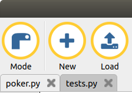
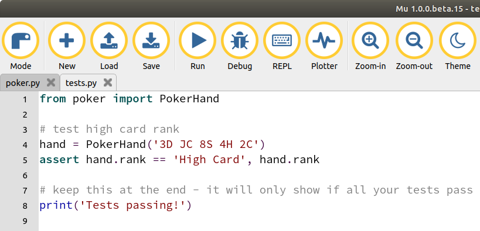
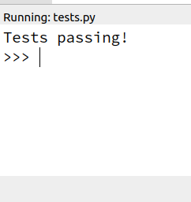
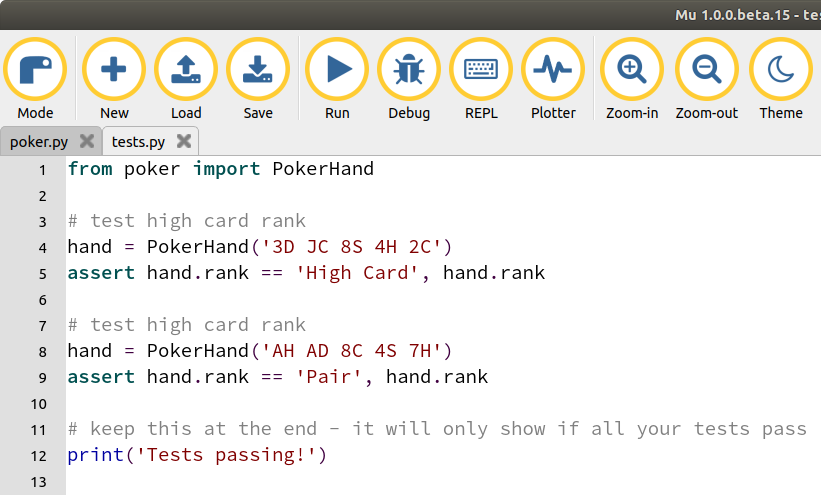
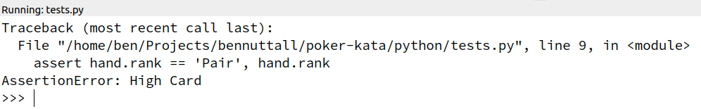
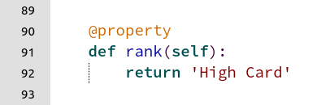
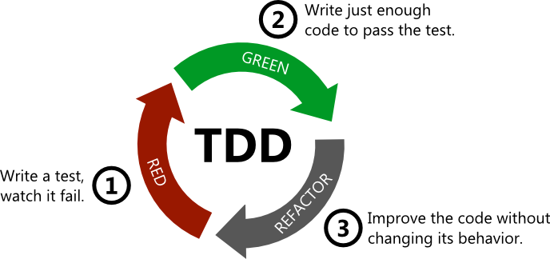

# Poker Hands kata

This is a test-driven development exercise for ranking hands in the card game of
[Poker](https://en.wikipedia.org/wiki/Poker).

Some starter code is provided. It is the beginnings of an implementation of a
poker hands comparison tool. In its current state it ranks all hands as 'high
card' regardless of the cards in the hand.

Your task is to extend the code (and the tests) in order to improve the
implementation to cover more hand types. The highest ranked hand type is
*Royal Flush* and the lowest is *High Card*. It is recommended that you work
your way up from *High Card*.

Refer to https://www.cardplayer.com/rules-of-poker/hand-rankings for rank
descriptions.

The end goal is to complete your ranking algorithm to correctly identify all
ranks, and be confident your tests cover all edge cases.

The first test has been written (and it passes), and your job is to write each
successive test, and make each pass without breaking the previous tests.

A "complete" set of tests has been provided which are intended to cover all edge
cases. Once you have completed the exercises you should try running this set of
tests to see if your code makes them all pass. Alternatively, you can work your
way through these tests one-by-one instead of writing your own.

This activity works well in pairs, but can also be completed alone.

## Instructions

1. Clone or download this repository, e.g `git clone https://github.com/bennuttall/poker-kata`
or download from https://github.com/bennuttall/poker-kata/archive/master.zip

1. Choose an editor/IDE. [Mu](https://codewith.mu/) is recommended for its
simplicity.

1. Navigate to the `python` directory and open `poker.py` and `tests.py` in your
editor:

    

1. Read the tests in the `tests.py` file:

    

    This shows a single test which creates a hand of five cards, and asserts
    that the hand's rank should be "High Card"

1. Run the tests:

    

1. You should see the message "Tests passing!"

    

1. Add a test to show that a hand with two cards of the same rank should be
ranked as "Pair". Try the hand `AH AD 8C 4S 7H`:

    

1. Now run your tests and watch it fail:

    

    This is good! You're proving that your code's features don't yet include
    the Pair ranking. This mean you have a single job to do: make it pass!

    Note that the assertion which failed shows the expected value, and the
    actual result is shown after `AssertionError:`. This is because after the
    assertion in the test, `hand.rank` is included after a comma. This ensures
    that the failing value is given with the output so you can see the value
    returned.

1. Now switch to the `poker.py` file in your editor. Have a look at the
implementation and see where the ranking code lives:

    

    This implementation couldn't be simpler! It returns "High card" regardless
    of the cards.

1. Now consider the easiest way of making the new test pass. Try to make the
smallest possible change to make this function return "Pair" for your new test,
but still return "High card" for the first. When you're ready to try it, save
the poker file and re-run your tests. Did you make both tests pass?

1. Return to your tests, and think of another test case for "Pair" which
differs from the previous one, for example `AH 3D TC 4S 3S`. Write the test for
this hand, and run it to see the results. Depending on your implementation,
this test may already pass. If not, modify your code to make all three tests
pass.

1. When you've managed to make the tests pass again, look at your code and
consider if you want to make any changes. Any changes at this stage should be
refactoring only (improving the code without changing its behaviour). It
shouldn't attempt to add any new features, just tidy up the code.

    This cycle is called **red-green-refactor**:

    

    Read more at [allaboutcircuits.com](https://www.allaboutcircuits.com/technical-articles/how-test-driven-development-can-help-you-write-better-unit-tests/)

1. Now you've got tests and an implementation for the first two ranks, write a
test for the next rank: Two Pair. When you've written your test, watch it fail,
then proceed to modify your `rank` property implementation to make it pass.
Remember to cycle through red -> green -> refector each time.

1. Keep going until you can identify all ten ranks, making sure you have
sufficient test coverage to cover all edge cases. Refer to
[cardplayer.com](https://www.cardplayer.com/rules-of-poker/hand-rankings)
for an example of each rank.

1. When you're happy with your test coverage, try running `tests_complete.py`
to see if you missed any!

## Extension

Once you have finished ranking hands, try something else:

- Compare two hands - which hand wins?
- Implement a deck for dealing cards from a complete deck of 52 cards
- Implement a [Texas Hold 'Em](https://en.wikipedia.org/wiki/Texas_hold_%27em)
version
- Implement a playable version with a command line interface
- Implement a graphical playable version using PyGame or PyGame Zero
- Calculate the probability of each rank from the unknown cards
